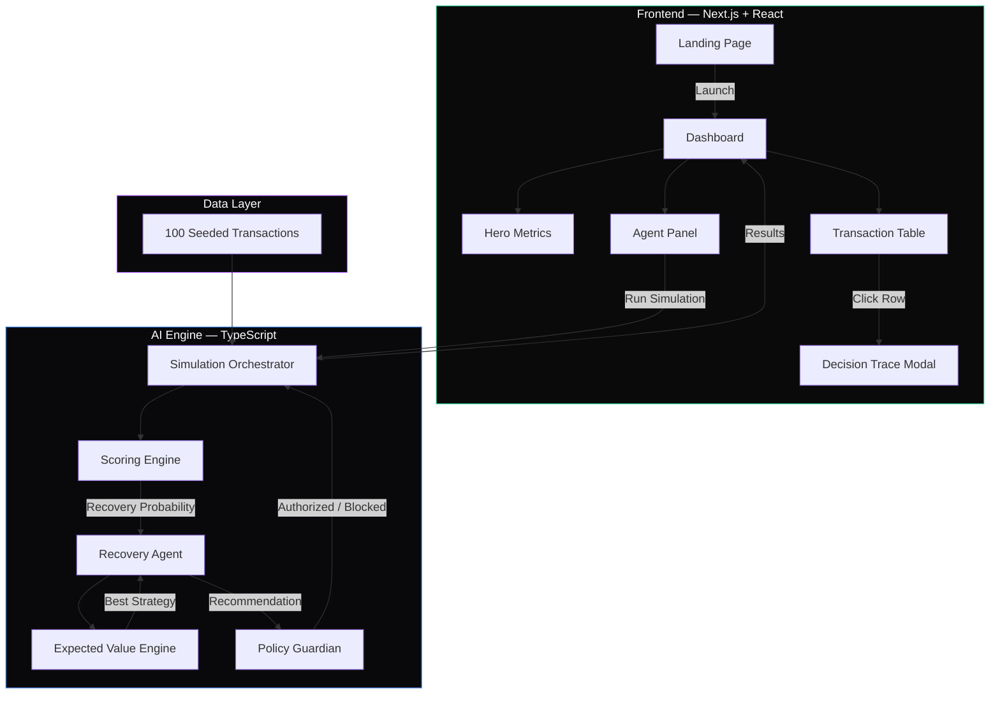
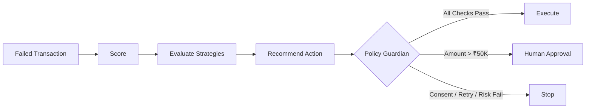

<div align="center">

# R.E.C.O.V.E.R.

### Autonomous Revenue Recovery Engine

An AI agent that treats every failed payment as an economic decision — not a retry.

[](https://nextjs.org)
[](https://react.dev)
[](https://www.typescriptlang.org)
[](https://tailwindcss.com)

<br/>


<br/>

**Built for the Razorpay AI Buildathon — Track: Revenue Recovery**

</div>

---

## Table of Contents

- [Overview](#overview)
- [The Problem](#the-problem)
- [Key Features](#key-features)
- [Architecture](#architecture)
- [How It Works](#how-it-works)
- [Tech Stack](#tech-stack)
- [Project Structure](#project-structure)
- [Getting Started](#getting-started)
- [Usage](#usage)
- [AI Agent Architecture](#ai-agent-architecture)
- [Screenshots](#screenshots)
- [Roadmap](#roadmap)
- [Contributing](#contributing)
- [License](#license)

---

## Overview

R.E.C.O.V.E.R. is an autonomous AI agent built to recover failed payments intelligently. Instead of applying the same static retry logic to every transaction, the system evaluates the **mathematical Expected Value** of multiple recovery strategies (Retry, Payment Link, Recovery Message, Wait, Escalate) and selects the intervention that maximizes recovered revenue while operating within strict, deterministic Policy Guardian boundaries.

The application processes a batch of 100 simulated failed transactions through a seven-stage autonomous pipeline (Detect → Diagnose → Predict → Decide → Guard → Execute → Verify) and visualizes the agent's decision-making in real time through a premium dark-mode financial operations dashboard.

---

## The Problem

> Failed payments cost businesses billions annually. The industry standard response is to blindly retry the charge or send a generic reminder email — treating every failure identically regardless of context.

**This approach fails because:**

| Scenario | Blind Retry Result |
| :--- | :--- |
| UPI timeout on a loyal customer | Unnecessary friction, customer churn risk |
| Expired card on a dormant user | Wasted processing cost, zero recovery chance |
| High-value transaction on a premium account | Autonomous action without merchant oversight |
| Customer who opted out of communications | Compliance violation |

**R.E.C.O.V.E.R. solves this** by making each failed payment a bounded economic decision: score the customer, calculate the expected value of every strategy, enforce merchant policies, and execute only the mathematically optimal intervention.

---

## Key Features

| Feature | Description |
| :--- | :--- |
| **Recovery Scoring Engine** | Calculates recovery probability using 5 weighted signals: customer history, failure type, retry count, recent activity, and customer lifetime value |
| **Expected Value Optimization** | Compares strategies (Retry vs Payment Link vs Message vs Wait) by computing `(Amount × Probability) − Cost` for each |
| **Policy Guardian** | Deterministic rules engine enforcing consent, retry limits, amount thresholds (>₹50K → human approval), and risk floors |
| **Human-in-the-Loop Escalation** | High-value transactions are automatically blocked from autonomous execution and escalated for manual review |
| **Agent Decision Trace** | Full transparency modal showing AI reasoning, probability breakdown, strategy comparison matrix, and policy check results |
| **7-Stage Autonomous Pipeline** | Animated visualization of Detect → Diagnose → Predict → Decide → Guard → Execute → Verify |
| **100-Transaction Batch Simulation** | Deterministic, seeded dataset of realistic Indian payment failures across UPI, Credit Card, Debit Card, Net Banking, and Wallet methods |
| **"Why Not Retry?" Explainer** | Interactive expected value comparison showing exactly why the agent chose one strategy over another |

---

## Architecture



---

## How It Works

```
1. DATA GENERATION
   100 deterministic transactions are generated using a seeded PRNG
   covering 8 failure types across 5 payment methods

2. SCORING ENGINE
   Each transaction is scored across 5 dimensions:
   ├── Customer History      (up to +25%)
   ├── Failure Type          (+21% transient → −20% expired)
   ├── Retry Count           (+13% first attempt → −15% 3+ retries)
   ├── Recent Activity       (+15% within 7 days → −5% over 30 days)
   └── Customer Value        (+10% for LTV > ₹50K)
   → Outputs a recovery probability between 5% and 98%

3. EXPECTED VALUE ENGINE
   For each strategy, computes:
   Expected Value = (Amount × Adjusted Probability) − Intervention Cost
   ├── RETRY:            Cost ₹180, probability reduced by 13%
   ├── PAYMENT LINK:     Cost ₹50,  base probability
   ├── RECOVERY MESSAGE: Cost ₹20,  probability reduced by 17%
   └── WAIT:             Cost ₹0,   probability reduced by 29%
   → Selects the strategy with the highest expected value

4. POLICY GUARDIAN
   Deterministic rules check before execution:
   ├── Customer Consent   — opted in?
   ├── Retry Limit        — attempts < 3?
   ├── Merchant Threshold — amount ≤ ₹50,000?
   └── Risk Threshold     — probability ≥ 25%?
   → BLOCKED actions route to STOP or HUMAN_APPROVAL

5. EXECUTION & VISUALIZATION
   Results are rendered in real time with animated pipeline
   steps, status badge updates, and aggregate metric counters
```

---

## Tech Stack

### Frontend
| Technology | Purpose |
| :--- | :--- |
| **Next.js 16** | App Router, SSR, file-based routing |
| **React 19** | UI component layer |
| **TypeScript 5** | Type-safe application code |
| **Tailwind CSS 4** | Utility-first styling, custom dark theme |
| **Framer Motion** | Pipeline animations, modal transitions, metric counters |
| **Recharts** | Data visualization (installed, available for charts) |
| **Lucide React** | Icon system |

### AI Engine (Client-Side TypeScript)
| Module | Responsibility |
| :--- | :--- |
| `scoringEngine.ts` | Multi-factor recovery probability calculation |
| `expectedValue.ts` | Strategy comparison via expected revenue optimization |
| `recoveryAgent.ts` | Diagnosis, reasoning generation, action recommendation |
| `policyGuardian.ts` | Deterministic safety rules enforcement |
| `simulation.ts` | 7-stage pipeline orchestration with async progress callbacks |

### Tooling
| Tool | Purpose |
| :--- | :--- |
| **ESLint 9** | Code quality |
| **PostCSS** | CSS processing pipeline |
| **Turbopack** | Next.js dev server bundler |

---

## Project Structure

```text
recover/
├── public/                          # Static assets
├── src/
│   ├── app/
│   │   ├── layout.tsx               # Root layout (Inter font, dark theme)
│   │   ├── page.tsx                 # Landing page
│   │   ├── globals.css              # Tailwind theme + custom utilities
│   │   └── dashboard/
│   │       ├── layout.tsx           # Dashboard shell (header, nav, status bar)
│   │       └── page.tsx             # Main dashboard (state management, simulation)
│   ├── components/
│   │   ├── ui/
│   │   │   ├── badge.tsx            # Status pill component
│   │   │   ├── button.tsx           # Button with variants
│   │   │   ├── card.tsx             # Card container
│   │   │   └── progress.tsx         # Progress bar
│   │   └── dashboard/
│   │       ├── HeroMetrics.tsx      # Top-level KPI cards
│   │       ├── AgentPanel.tsx       # Pipeline visualization + run button
│   │       ├── TransactionTable.tsx # 100-row interactive table
│   │       └── DecisionTraceModal.tsx # AI reasoning + strategy matrix modal
│   └── lib/
│       ├── utils.ts                 # cn() helper + INR currency formatter
│       ├── data/
│       │   └── demoTransactions.ts  # Seeded PRNG, 100 mock transactions
│       └── engine/
│           ├── scoringEngine.ts     # 5-factor probability calculator
│           ├── expectedValue.ts     # Strategy expected value comparator
│           ├── recoveryAgent.ts     # AI reasoning + action selector
│           ├── policyGuardian.ts    # 4-rule safety gate
│           └── simulation.ts        # Pipeline orchestrator
├── next.config.ts
├── tailwind.config.ts               # (via Tailwind v4 CSS-first config)
├── tsconfig.json
├── package.json
└── .gitignore
```

---

## Getting Started

### Prerequisites

- **Node.js** ≥ 18
- **npm** (included with Node.js)

### Installation

```bash
# Clone the repository
git clone <ADD_REPOSITORY_URL>
cd recover

# Install dependencies
npm install
```

### Running the Application

```bash
# Start the development server
npm run dev
```

Open [http://localhost:3000](http://localhost:3000) in your browser.

### Production Build

```bash
npm run build
npm start
```

---

## Usage

### 1. Landing Page
Navigate to `http://localhost:3000`. Click **LAUNCH RECOVERY AGENT** to enter the dashboard.

### 2. Inspect a Transaction
Click any row in the Failed Payments table to open the **Agent Decision Trace** modal. Observe:
- Transaction context (customer, amount, failure type, LTV)
- AI reasoning (animated typewriter effect)
- Recovery probability with factor-by-factor breakdown
- Recommended action with expected value
- Policy Guardian authorization checks

### 3. Explore "Why Not Retry?"
Inside the modal, click **WHY NOT RETRY?** to reveal the **Strategy Evaluation Matrix** — a side-by-side comparison of every intervention's probability, cost, and expected revenue.

### 4. Run the Simulation
Click **RUN RECOVERY SIMULATION** on the Agent Panel. Watch the 7-stage pipeline animate through detection, diagnosis, prediction, decision, policy checks, execution, and verification. The table and metrics update in real time.

### 5. Human-in-the-Loop
Find transaction **RX-9284** (Vikram Joshi, ₹72,000). The Policy Guardian blocks autonomous execution because the amount exceeds the ₹50,000 merchant threshold, routing it to **HUMAN APPROVAL**.

---

## AI Agent Architecture

The recovery agent follows a strict **Agent → Guardian → Execution** pipeline. The AI recommends; it never executes directly.



### Agent Decision Pipeline

| Stage | Engine | Output |
| :--- | :--- | :--- |
| **Detect** | `simulation.ts` | Identifies failed payment in queue |
| **Diagnose** | `recoveryAgent.ts` | Classifies failure type and generates diagnosis |
| **Predict** | `scoringEngine.ts` | Computes recovery probability (5 weighted factors) |
| **Decide** | `expectedValue.ts` | Selects strategy with highest expected value |
| **Guard** | `policyGuardian.ts` | Validates against 4 deterministic business rules |
| **Execute** | `simulation.ts` | Applies authorized action or escalates |
| **Verify** | `simulation.ts` | Confirms outcome and logs audit trail |

### Policy Guardian Rules

| Rule | Condition | Violation Action |
| :--- | :--- | :--- |
| Customer Consent | `consent_status === true` | → STOP |
| Retry Limit | `attempt_count < 3` | → STOP |
| Merchant Threshold | `amount ≤ ₹50,000` | → HUMAN_APPROVAL |
| Risk Threshold | `probability ≥ 25%` | → STOP |

---

## Screenshots

> Screenshots can be added to the `public/` directory and referenced here.

```
public/
├── screenshot-landing.png
├── screenshot-dashboard.png
├── screenshot-decision-trace.png
├── screenshot-why-not-retry.png
└── screenshot-simulation.png
```

| View | Description |
| :--- | :--- |
| **Landing** | Dark-mode hero with "SYSTEM ONLINE" indicator and launch CTA |
| **Dashboard** | Revenue metrics, agent pipeline panel, 100-row transaction table |
| **Decision Trace** | AI reasoning, probability breakdown, policy authorization |
| **Why Not Retry?** | Expected value matrix comparing all strategies |
| **Simulation** | Animated pipeline with real-time status updates |

---

## Contributing

Contributions are welcome.

```bash
# 1. Fork the repository

# 2. Create a feature branch
git checkout -b feature/your-feature-name

# 3. Make your changes and commit
git commit -m "feat: add your feature description"

# 4. Push to your fork
git push origin feature/your-feature-name

# 5. Open a Pull Request
```

---

## License

Licensing information has not yet been specified for this repository.

---

<div align="center">

**Built for the Razorpay AI Buildathon**

*"Every failed payment is a decision."*

⭐ Star this repository if you find it useful

</div>
